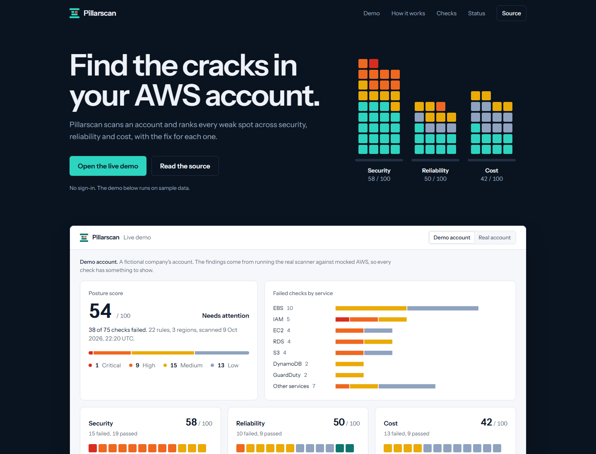
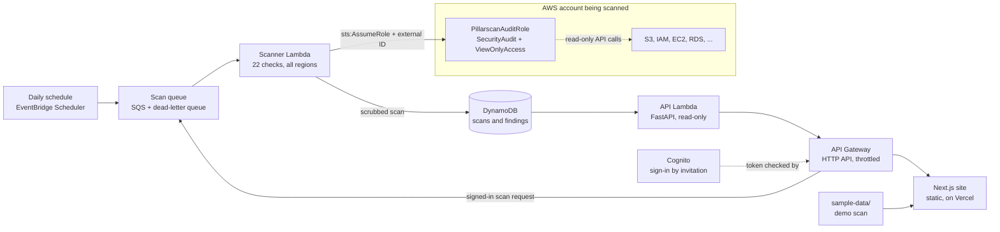

# Pillarscan

[](https://github.com/Asiwomex/Pillarscan/actions/workflows/ci.yml)

Pillarscan scans an AWS account with read-only access and ranks every weak spot it finds across three AWS Well-Architected pillars: security, reliability and cost. Each finding names the exact resource, says why it matters and gives the fix.

**Live demo: [pillarscan.lytaworks.com](https://pillarscan.lytaworks.com/)** (also at [pillarscan.vercel.app](https://pillarscan.vercel.app/)). It opens straight into a populated dashboard on sample data, with no sign-in.

[](https://pillarscan.lytaworks.com/)

It is a portfolio project by [Asiwome Boateng](https://asiwomex.vercel.app/), not a product.

## What is built

| Part | State | Where |
|---|---|---|
| Scanner: 22 checks, run from the command line | Built | [scanner](scanner) |
| Tests: every check tested against mocked AWS | Built | [tests](tests) |
| Read-only role template for the account being scanned | Built | [onboarding](onboarding) |
| Site: landing page and dashboard, opening on sample data | Built | [web](web) |
| Backend: a daily scan on Lambda, stored in DynamoDB, served by an API | Built | [infra/platform](infra/platform), [api](api) |
| Scan history in the dashboard | Built | [web](web) |
| Sign in (by invitation), connect an AWS account and scan it from the browser | Built | [web/app/account](web/app/account), [infra/platform/auth.tf](infra/platform/auth.tf) |

## How it fits together



The scanner never calls a write API. The role it assumes carries two AWS managed policies, `SecurityAudit` and `ViewOnlyAccess`, and its trust policy only accepts the call when the scanner sends the agreed external ID. The scanner Lambda's own role cannot read the account at all: it can only take a message, read the external ID, assume the audit role and write the result.

The API is public until sign-in exists, so scans are stored with the account ID, user names and resource IDs already replaced. The same scanner also runs from the command line.

## Run the scanner

Requires Python 3.12 or newer. Commands are for PowerShell.

```powershell
python -m venv .venv
.venv\Scripts\Activate.ps1
pip install -e ".[dev]"
python -m scanner --profile <aws-profile> --out findings.json
```

That scans with the profile's own permissions. To scan through the read-only role instead, deploy [onboarding/pillarscan-role.yaml](onboarding/pillarscan-role.yaml) with CloudFormation in the account you want scanned, then pass the role and the external ID you chose:

```powershell
python -m scanner --profile <aws-profile> --role-arn <role-arn> --external-id <external-id>
```

A scan of 17 regions takes under a minute. `findings.json` contains real account IDs and ARNs, so it is git-ignored. To publish a scan as demo data, scrub it first:

```powershell
python -m scanner.scrub findings.json sample-data/findings.json
```

## Checks

| Check | What it flags | Pillar | Severity |
|---|---|---|---|
| `iam_root_mfa` | Root account without MFA | Security | Critical |
| `cloudtrail_multi_region` | CloudTrail not enabled in all regions | Security | High |
| `ec2_security_group_open_admin_ports` | Security group open to the internet on port 22 or 3389 | Security | High |
| `iam_policy_full_admin` | IAM policy granting * on * | Security | High |
| `iam_user_mfa` | IAM user without MFA | Security | High |
| `rds_public_access` | Publicly accessible RDS instance | Security | High |
| `s3_public_access_block` | S3 bucket without public access block | Security | High |
| `ebs_default_encryption` | EBS default encryption off | Security | Medium |
| `guardduty_enabled` | GuardDuty not enabled | Security | Medium |
| `iam_access_key_age` | Access key older than 90 days | Security | Medium |
| `rds_backup_retention` | RDS automated backups disabled | Reliability | High |
| `autoscaling_single_az` | Auto scaling group in a single availability zone | Reliability | Medium |
| `dynamodb_pitr` | DynamoDB table without point-in-time recovery | Reliability | Medium |
| `rds_multi_az` | RDS instance without Multi-AZ | Reliability | Medium |
| `lambda_dead_letter_queue` | Lambda function without a dead-letter queue | Reliability | Low |
| `s3_versioning` | S3 bucket without versioning | Reliability | Low |
| `ebs_unattached_volume` | Unattached EBS volume | Cost | Medium |
| `elb_no_targets` | Load balancer with no targets | Cost | Medium |
| `ebs_gp2_volume` | gp2 volume that could be gp3 | Cost | Low |
| `ebs_old_snapshot` | EBS snapshot older than 90 days | Cost | Low |
| `ec2_unassociated_eip` | Unassociated Elastic IP | Cost | Low |
| `logs_no_retention` | CloudWatch log group with no retention set | Cost | Low |

Each check is one file in [scanner/checks](scanner/checks), named after its `check_id`. A check that cannot run produces a finding with status `error` and the scan carries on. Checks run once per enabled region unless the service is global; pass `--regions us-east-1,us-east-2` to limit a scan.

## Backend

Terraform in [infra/platform](infra/platform) creates the queue, both Lambdas, the table, the API and two alarms. State is kept in an S3 bucket made by [infra/bootstrap](infra/bootstrap).

```powershell
python scripts/build_lambdas.py
cd infra/platform
terraform init -backend-config=backend.hcl
terraform apply
```

The public routes are `GET /health`, `GET /scans` for the history and `GET /scans/{scan_id}` for one scan (`latest` works as an ID). The `/me/...` routes are for signed-in users: connect an account, request a scan and read your own scans.

## Signing in and connecting an account

Anyone can open the demo. Scanning your own account needs a sign-in, and sign-in is by invitation: self sign-up is switched off in Cognito, and an administrator creates each user.

1. **Sign in.** The site sends you to Cognito's own sign-in page and gets back a short-lived token (authorization code flow with PKCE). The site never sees a password.
2. **Connect an account.** You enter a 12-digit AWS account ID. Pillarscan makes up an external ID and a role name for that connection.
3. **Create the role.** A link opens CloudFormation in your account with the [role template](onboarding/pillarscan-role.yaml) filled in. The role is read-only and trusts only Pillarscan's scanner, and only when it presents that external ID.
4. **Scan.** The request goes on the queue, the scanner assumes your role and the result is stored for you alone.

Three things keep one user away from another's data:

- API Gateway checks the token before the API runs, and the API takes the user's identity only from that verified token.
- Each connection has its own external ID, so knowing someone's account ID is not enough to be let into their role.
- Scans are filed under the user and the account together. Two users who connect the same account cannot read each other's results.

To invite someone, create their user (they get an email with a temporary password):

```powershell
aws cognito-idp admin-create-user --user-pool-id <pool-id> --username <their-email>
```

## Site

A Next.js app in [web](web): a landing page with the dashboard embedded as the live demo. The dashboard shows a posture score, failed checks by service, one block per finding in each pillar, and a filterable table with a detail panel that explains each finding and how to fix it.

```powershell
cd web
pnpm install
pnpm dev
```

The score is the severity-weighted share of checks that passed; see [web/lib/score.ts](web/lib/score.ts). The visual direction is written down in [DESIGN.md](DESIGN.md).

## Sample data

The site reads two files in [sample-data](sample-data) at build time:

- `demo-findings.json`: a fictional company's account. [generate_demo.py](sample-data/generate_demo.py) builds it by running the real scanner against mocked AWS, so every check has something to show without paying for RDS instances or load balancers.
- `findings.json`: a scan of this project's own AWS account, scrubbed. The misconfigured resources in it are created on purpose by [infra/bait](infra/bait).

## Tests

```powershell
pytest
```

Tests run against [moto](https://github.com/getmoto/moto), which mocks AWS in memory. They never touch a real account. GitHub Actions runs them on every push, along with a lint of the role template and the site's lint, type-check and build.

## Cost

The project is built to cost well under a dollar a month. The backend stays inside AWS's always-free allowances for Lambda, SQS, DynamoDB and CloudWatch alarms. The scanner makes only free read calls and never uses the Cost Explorer API, which is billed per request. Checks for expensive resources (RDS, load balancers, Elastic IPs) are tested against mocked AWS instead of real ones.

Pillarscan is an independent project and is not affiliated with, endorsed by or sponsored by Amazon.
